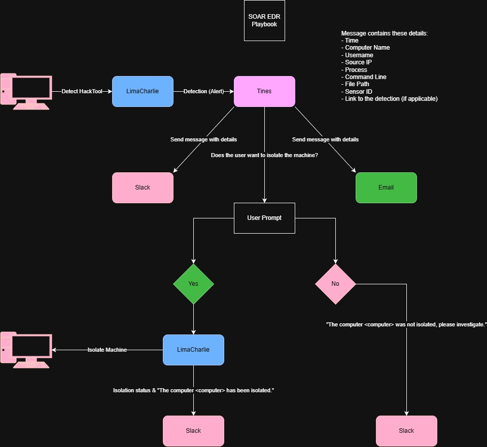
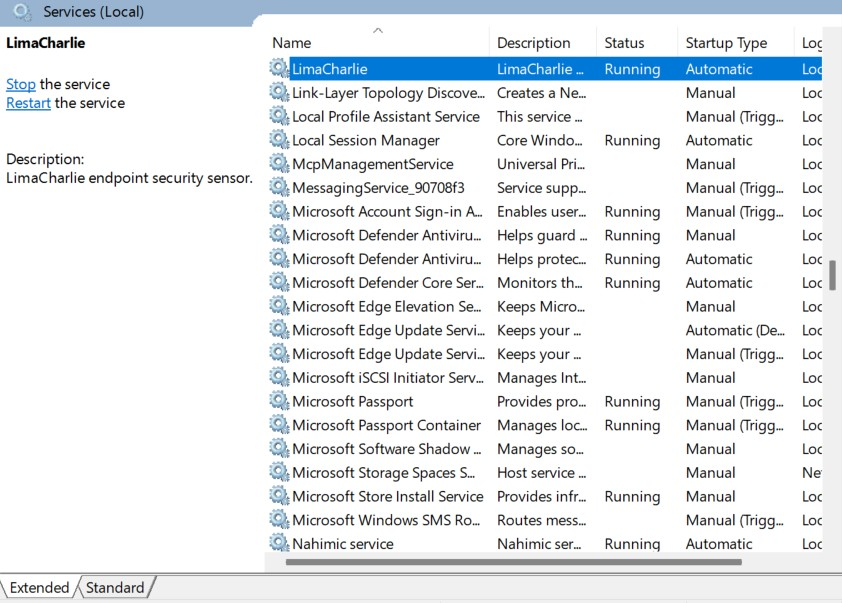
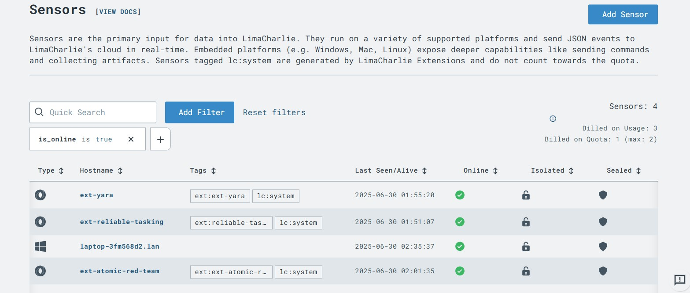

# SOAR EDR Project - John Yang

## Objective

This SOAR-EDR Integration project was designed to demonstrate the orchestration of automated security workflows using LimaCharlie (EDR) and Tines (SOAR). The primary objective was to configure and link these platforms to simulate real-time threat detection, response, and remediation. By automating actions such as alerting through communication platforms and endpoint containment, the project highlights the operational benefits of integrating detection and response tools. This hands-on implementation deepened practical understanding of modern incident response, threat intelligence integration, and the role of automation in scaling security operations.

### Skills Learned

- Hands-on experience configuring and integrating SOAR and EDR platforms (Tines and LimaCharlie).
- Proficiency in building automated security workflows for real-time incident response.
- Practical understanding of endpoint telemetry, threat detection, and response orchestration.
- Improved knowledge of API-based integrations and event-driven security automation.
- Strengthened ability to design scalable, efficient workflows for modern SOC environments.

### Tools Used

- LimaCharlie (Endpoint Detection and Response) for collecting endpoint telemetry and detecting threats.
- Tines (Security Orchestration, Automation, and Response) for building automated security workflows.
- Webhooks and APIs for integrating EDR alerts with SOAR playbooks.
- Custom workflow actions in Tines for automation of alerts and initiating response actions.
  
## Steps

### Part 1: Making the Playbook

Before implementation, it was essential to develop a diagram of a hypothetical Incident Response Playbook so that I could easily visualize the interactions between the computer, user, LimaCharlie, Tines, Slack, Email, and the security team. This diagram clarified the end-to-end workflow—from threat detection to automated response—and served as a blueprint for building the integration.

If malicious software was detected by LimaCharlie, LimaCharlie will alert Tines, then Tines will send a message to Slack and an email to the security team. In Tines, there will be a user prompt that asks if the person viewing the prompt wants to isolate the machine or not. If the person selects "Yes", LimaCharlie will isolate the computer from all networks, and a message of confirmation of isolation will be sent to Slack. If the person selects "No", a message will be sent to Slack asking the team to investigate the issue.

### Part 2: Getting Started with LimaCharlie

Navigate to https://app.limacharlie.io, create an account, and download LimaCharlie on a device of your choosing. It could be an old computer, or a virtual machine. 

After the download is complete, run the executable to set up the LimaCharlie agent.

Done!

We see that LimaCharlie's agent has successfully installed and is running on our endpoint device.

After doing this, we should see a new sensor added to the sensor list on LimaCharlie's web based client. 

### Part 3: Detection and Response Rules in LimaCharlie

For our simulated event, we will use a script called LaZagne. You can download it here: https://github.com/AlessandroZ/LaZagne

I created a set of detection and response rules so that LimaCharlie appropriately detects the execution of LaZagne on our endpoint device.

