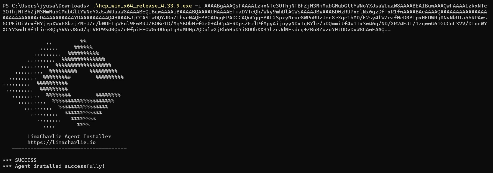

# SOAR EDR Project - John Yang

## Objective

This SOAR-EDR Integration project was designed to demonstrate the orchestration of automated security workflows using LimaCharlie (EDR) and Tines (SOAR). The primary objective was to configure and link these platforms to simulate real-time threat detection, response, and remediation. By automating actions such as alerting through communication platforms and endpoint containment, the project highlights the operational benefits of integrating detection and response tools. This hands-on implementation deepened practical understanding of modern incident response, threat intelligence integration, and the role of automation in scaling security operations.

### Skills Learned

- Hands-on experience configuring and integrating SOAR and EDR platforms (Tines and LimaCharlie).
- Proficiency in building automated security workflows for real-time incident response.
- Practical understanding of endpoint telemetry, threat detection, and response orchestration.
- Improved knowledge of API-based integrations and event-driven security automation.
- Strengthened ability to design scalable, efficient workflows for modern SOC environments.

### Tools Used

- LimaCharlie (Endpoint Detection and Response) for collecting endpoint telemetry and detecting threats.
- Tines (Security Orchestration, Automation, and Response) for building automated security workflows.
- Webhooks and APIs for integrating EDR alerts with SOAR playbooks.
- Custom workflow actions in Tines for automation of alerts and initiating response actions.
  
## Steps

### Part 1: Making the Playbook

Before implementation, it was essential to develop a diagram of a hypothetical Incident Response Playbook so that I could easily visualize the interactions between the computer, user, LimaCharlie, Tines, Slack, Email, and the security team. This diagram clarified the end-to-end workflow—from threat detection to automated response—and served as a blueprint for building the integration.

If malicious software was detected by LimaCharlie, LimaCharlie will alert Tines, then Tines will send a message to Slack and an email to the security team. In Tines, there will be a user prompt that asks if the person viewing the prompt wants to isolate the machine or not. If the person selects "Yes", LimaCharlie will isolate the computer from all networks, and a message of confirmation of isolation will be sent to Slack. If the person selects "No", a message will be sent to Slack asking the team to investigate the issue.

### Part 2: Getting Started with LimaCharlie

Navigate to https://app.limacharlie.io, create an account, and download LimaCharlie on a device of your choosing. It could be an old computer, or a virtual machine. 

After the download is complete, run the executable along your installation key the to set up the LimaCharlie agent.

The installation key should be located in the "Sensors" section.

Type in this command in PowerShell, and it should be done!

We see that LimaCharlie's agent has successfully installed and is running on our endpoint device.

After doing this, we should see a new sensor added to the sensor list on LimaCharlie's web based client. 

### Part 3: Detection and Response Rules in LimaCharlie

For our simulated event, we will use an application called LaZagne. You can download it here: https://github.com/AlessandroZ/LaZagne

Note that Windows Real-Time Detection should be turned off for the downloading of the executable.

I created a set of detection and response rules so that LimaCharlie appropriately detects the execution of LaZagne on our endpoint device.

Detection: 

Response: 

Let's test this out. Since we established our detection parameters, if we run LaZagne on our device, a detection should pop up on our LimaCharile client.

Lets run LaZagne!

And voila, we caught it!

### Part 4: Link everything together with Tines

Since we have our detections set up, we need to forward any detections made on LimaCharlie to Tines, a SOAR platform, so that we can automate the remaining tasks on our playbook.

Sign up for an account on https://www.tines.com/.

After we load our first Tines story, we'll see this interface.

In order to bring our detections from LimaCharlie to Tines, we'll need to use a webhook. You can drag a webhook from the left bar of Tines.

After dragging the webhook on the interface, copy the Webhook URL, navigate to the "Outputs" section on the LimaCharlie client, add a new output, and paste the URL into the "Destination" bar.

Now, our LimaCharlie and Tines should be connected.

To test the connection, run LaZagne on the endpoint device and see if there is an event generated on the webhook.

On LimaCharlie, the detection details looks like this:

And now navigating to Tines,

Here we see that the information from LimaCharlie's detection tab has been forwarded exactly to Tines. Nice!

Now, we need to implement the messaging part of our playbook.

We can use a Tines templates for sending messages through Slack and Email and connect it to our webhook.

Note that we will need to authorize our Slack account with Tines, this can be done on the "Credentials" section on the right side of Tines.

Our slack is now set up.

For the automated email, simply insert which email address/addresses you want to alert.

For the contents of the alert messages, follow the message details we outlined in the playbook.

The details can be taken directly from the event details (Detection) that our webhook receives as a path, as we can see above.

So far, this is how our workflow looks. If webhook receives a detection from LimaCharlie, Tines will automatically send an alert message to Slack and Email.

Now, we need to implement the user prompt part of our playbook on Tines. We can do this by utilizing the Page editing tool on Tines.

This is how our user prompt page will look:

On the editing tool, add a header for the title, a text bar that contains the paths to the message details that we specified, a boolean for the Y/N choice, and finally a button to submit the response.

Now, all we have left is to set up the "Yes" and "No" paths based on our playbook.

We can use the "Trigger" tool located on the left bar of Tines, which will trigger the following action based on the boolean chosen by the user on the prompt. 

Let's implement the "Yes" path first. Prior to doing this, we need to set up a credential on Tines using LimaCharlie's API key. 

Navigate to "Access Management" then click on "REST API", and copy the "Org JWT".

After doing this, add a Text credential on Tines (on the right side) and paste the Org JWT on the "Value" section.

Tines should now have access to automate actions on LimaCharlie.

Returning back to the "Yes" path, we first want to isolate the computer that LaZagne was deployed on. We can do this by dragging a LimaCharlie template on Tines named "Isolate Sensor".

The URL section of the template will look like this:

We can take the Sensor ID logged on our webhook event to have LimaCharlie isolate the computer on that specific sensor.

After the computer has been isolated, we will send a confirmation message to Slack that looks like this:

We can simply add another Slack message template on Tines to accomplish this.

That finishes the "Yes" path!

And finally, for the "No" path, all we need to do is add one more Slack message template, and write another message that reads:

Here is what our full Tines workflow looks like:

### Part 5: A Full Simulation to Check Functionality

Since we have completed our Tines workflow based on our playbook, lets see if everything runs properly!

I have screenrecorded both a command line of the endpoint device and what a member responding to the event will see (on another device).

View of the endpoint (If "Yes" is chosen):

https://github.com/user-attachments/assets/d16550f1-6b0f-484e-809c-a3811796f284

View of the respondent (If "Yes" is chosen):

https://github.com/user-attachments/assets/029648fe-23d9-4ce1-818f-e37869004ba8

As we can see from the videos, everything works perfectly! 

When LaZagne was ran on our endpoint, we can see that a detection rolled in on LimaCharlie (respondent view).

The webhook brought in the event into Tines, the Slack message and Email was sent properly.

To check if the automated isolation worked, I continously ping 8.8.8.8 on the endpoint device.

After accessing the user prompt page based on the recent event and answering "Yes", we can see the ping that worked suddenly respond with "General Failure" starting from 1:08 of the Host recording, indicating that the device has been isolated from all network connections.

Finally, the confirmation message was sent to Slack after the isolation. Great!

For the "No" path, here is now it looks:

https://github.com/user-attachments/assets/15adaa6d-1e46-476d-a812-e9d9e65209f6

We do not need to consider the ping and the isolation status because we will not be isolating the device, but we can see that the Slack message prompting further investigation has been sent.

## Conclusion

Coming into this project, my knowledge of EDR and SOAR technologies was largely theoretical, coming from studying for courses and certifications. Actually getting to implement these systems, connect them through APIs, and design a complete workflow from detection to response was both eye-opening and incredibly rewarding. I was able to bridge the gap between abstract concepts and real-world application, and acquire a deeper appreciation for how modern security operations function. This project bolstered my enthusiasm for cybersecurity and desire to keep learning through hands-on experiences, and I definitely will be doing more projects like these. Thank you for reading!

## Contact

Email: <johnyang4406@gmail.com>, <john_s_yang@brown.edu>

LinkedIn: <https://www.linkedin.com/in/john-yang-747726292/>

